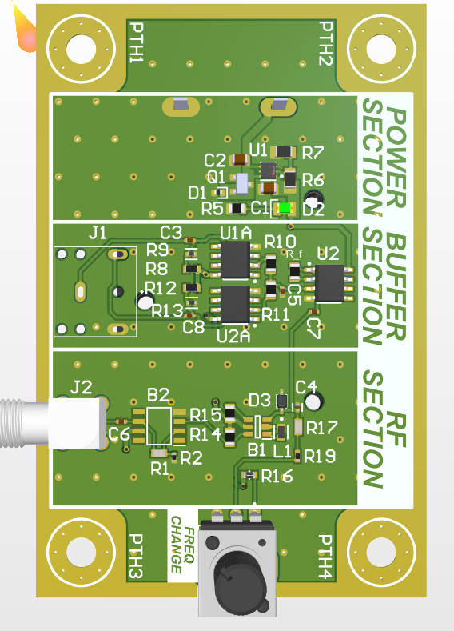

# FM_transmitter
# FM Transmitter Project

This project is a DIY FM transmitter that allows you to broadcast audio from your device to nearby FM radios. It's a fun and educational project suitable for beginners and hobbyists interested in electronics and radio transmission.

## Features

- **Adjustable Frequency**: Tune the transmitter to any FM frequency within the legal range.
- **Compact Design**: The circuit is designed to be compact and portable, making it easy to carry around.
- **Compatible with Various Audio Sources**: Connect your smartphone, MP3 player, or any audio source with a minijack 3.5mm.
- **Low Power Consumption**: Operates on low voltage with high power output for longer range

## Images

*Figure 1: Circuit diagram of the FM transmitter.*

*Figure 2: Assembled FM transmitter on a PCB.*

## Getting Started

To build the FM transmitter, follow these steps:

1. Gather all the necessary components listed in the materials section.
2. Route the components according to the circuit diagram provided.
3. Order your PCB in one of manufacturers (my choice was JLC PCB)
4. Tune your FM radio to an empty frequency using potentiometer.
5. Connect your audio source to the transmitter and start broadcasting in range of 80-110Mhz.

For detailed instructions and troubleshooting tips, refer to the [documentation](docs/instructions.md).

## Materials

For a complete list of components and where to source them, see the [components list](FM_transmitter.BomDoc).

## License

This project is licensed under the MIT License - see the [LICENSE](LICENSE) file for details.
